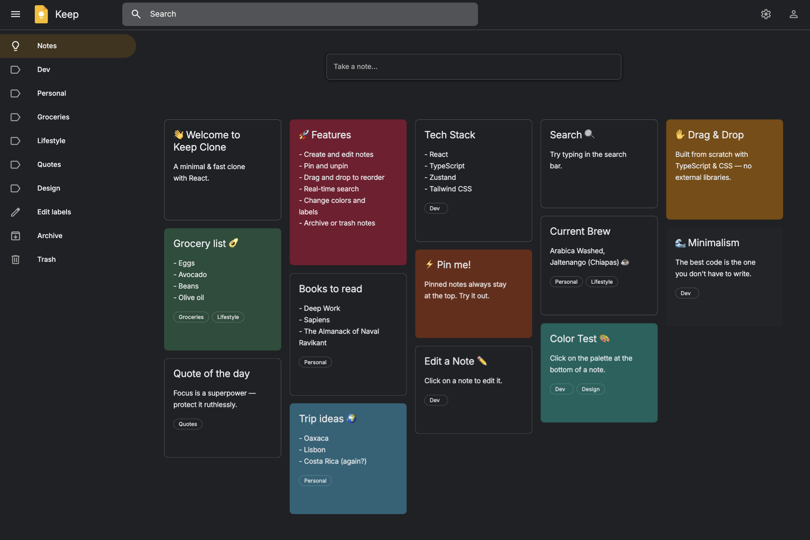

# Google Keep – From Scratch

A fast, minimal Google Keep-inspired notes app. Features a custom masonry grid with smooth drag & drop built from scratch with TypeScript & CSS.

 

  

<h3 align="center">
  <a href="https://keep-clone-amadeuio.netlify.app">👉 Demo</a>
</h3>

## Highlights

- **Fully custom UI**: All animations, interactions, and drag-and-drop mechanics are implemented from scratch using TypeScript & CSS transforms. No external UI libraries, no DnD frameworks
- **Fluid interactions**: Notes gracefully reflow on resize, archive, delete, or pin; animations emerge naturally from the layout engine
- **Selector-driven architecture**: Memoized selectors power most logic, keeping components thin and updates predictable
- **Surprisingly scalable**: Features like pinning were added by updating selectors, with almost no component changes
- **Performance-oriented**: Leverages the transform-based movement combined with minimal re-renders for a snappy feel
- **Lightweight**: ~3,000 lines of code, zero UI libraries

## Tech Stack

- React 19
- TypeScript
- Zustand
- Reselect
- Tailwind CSS

## License

[MIT](https://choosealicense.com/licenses/mit/)
